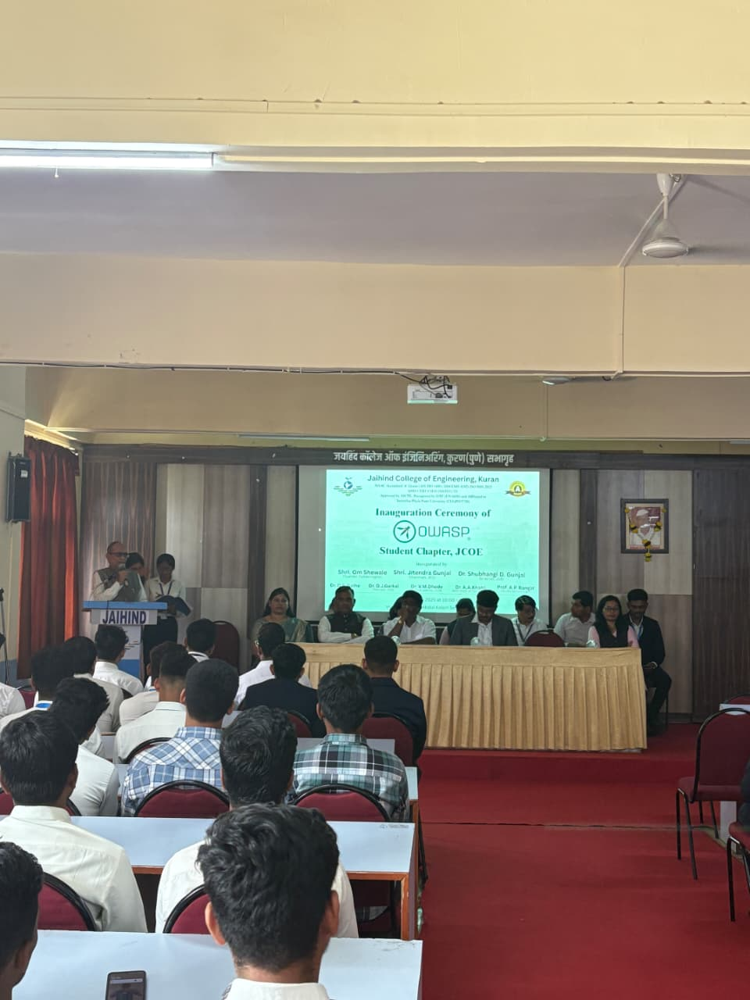
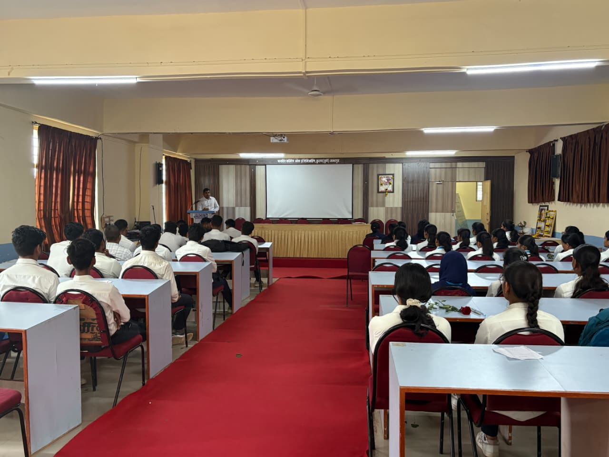
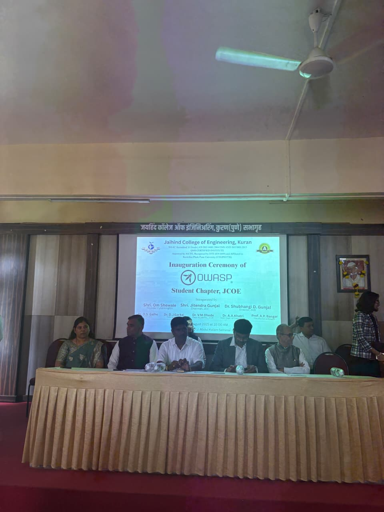

## 🗓️ Past Events
- **State Level CTF Competition**
  - **Date:** March 2025
  - **Participants:** 200
  - **Description:** Our chapter hosted a state level Capture The Flag (CTF) competition at Jaihind College of Engineering, Kuran. The event attracted 200 participants from across the state, offering challenging problems in web security, cryptography, reverse engineering, and more. It was a great opportunity for students to showcase their skills and collaborate with peers passionate about cybersecurity.---
title: Past Events
layout:  null
tab: true
order: 2
tags: example-tag

### Event Images
****
****
****

---
