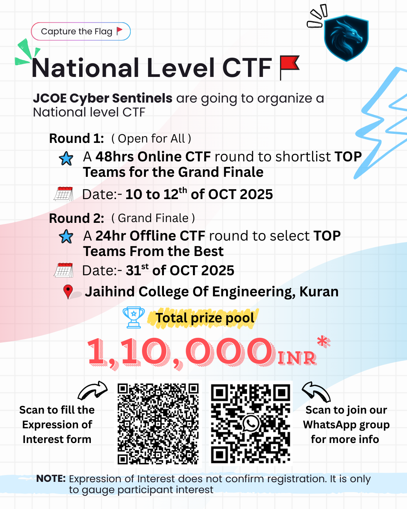

## 🗓️ Upcoming Events

---

### **National Level CTF Competition 2025**
**Organized by:** JCOE Cyber Sentinels  
**Rounds:** 2 (Online + Offline)  
**Prize Pool:** ₹1,10,000

#### 🥇 Round 1: 48hr Online CTF (Open for All)
- **Dates:** 10th to 12th October 2025
- **Format:** Online, 48 hours, open to all teams nationwide
- **Goal:** Shortlist top teams for the Grand Finale

#### 🏆 Round 2: 24hr Offline CTF Grand Finale
- **Date:** 31st October 2025
- **Location:** Jaihind College Of Engineering, Kuran
- **Format:** Offline, 24 hours, top teams from Round 1 compete for the championship

#### 💰 Prize Pool & Sponsorship
- **Total Prize Pool:** ₹1,10,000
- Accommodation and meals (lunch/dinner) provided for participants in the offline round

#### 📝 Expression of Interest
- Scan the QR code on the poster below to express interest (not final registration)
- Join our WhatsApp group via the second QR for updates

